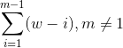

# Multi-word Tokenization

## NOTE
* THE MODULE IS IN ALPHA VERSION, SOME FUNCTIONS AREN'T BACKWORD COMPATIBLE.

## Background
One of the things NLP suffers from, at least in English, is that tokenizing function has a hard time extracting multi-words, such as "New York", from input text.<br>
However, for the practical usage, they need to be treated as one word.

## Usage
* Install the module using pip:

```
pip install multiword_tokenization
```

* Before using the module, you need to prepare a list of multi-words to extract. If you have csv file splitted by newline character, you can feed them to the instance.
* For user's convenience, the class will allow user to specify Python function to tokenize input text. You can use your favorite tokenizer. In the example below, `nltk` package is used.

```python
from multiword_tokenization import MultiWordTokenizer
from nltk.tokenize import word_tokenize

keywords = ['New York', 'San Francisco', 'New Orleans']
mword_tokenizer = MultiWordTokenizer(word_tokenize, keywords)
```
* Then, all you have to do is to call `tokenize` method:
```python
text = 'A Python event was held in New York.'
tokenized = mword_tokenizer.tokenize(word_tokenize, text)

print(tokenized)
>>> ['A', 'Python', 'event', 'was', 'held', 'in', 'New York', '.']
```

## What happens under the hood
1. User-specified Python function will tokenize input text: 
`['A', 'Python', 'event', 'was', 'held', 'in', 'New', 'York', '.']`
2. A sliding-"window" will be applied to every multi-word and replace if it is one of the keywords, until there's nothing to replace: `A Python`, `Python event`, ..., `New York` (keyword!), `York .`

### Algorithm
Method `__replace_one_word` is called while "connecting" words.
Letting `w` denote the word count of the input text, `m` the length of the longest keyword/entity, the complexity can be represented as following:



Therefore, the longer the input text is, or the longer the keyword that has the maximum length is, the more time it it takes.


## Contribution / Wanted
* The module is very expensive, considering it has a lot of for loops. C/C++ extension will be nice to implement to make it faster.
* Integration with CI tool, such as Travis


## License
Apache Licence 2.0